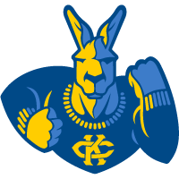
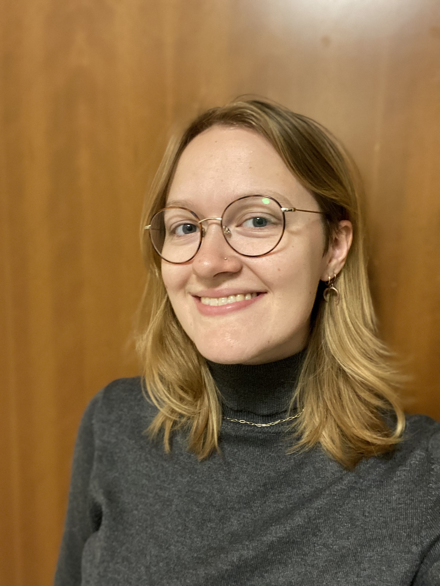

---

|  | | Our group aims to explore and address the problems at the intersection of AI, Security, Privacy, Fairness, and Science. **Also, we are very happy to help people from different groups understand cutting-age AI techniques, such as large language models.**
|

<!--  Lab Members  -->
<!-- ====== -->

<!-- [Rakib Ul Haque](https://scholar.google.com/citations?user=Le-WWW0AAAAJ&hl=en) received his M.S. degree from University of Chinese Academy of Sciences. He will join SecMLSys as a Ph.D. student. in Spring 2024. He has published several papers on the topic of security and privacy. -->

**PhD Students**: 

Several PhD students starting from Fall 2024

**Master Students**:

|  | | Pengrui Zhu: I am graduate student in computer science at University of Missouri-Kansas City.  My academic pursuits and research interests revolve around the fields Machine learning, DevOps, Full-stack Dev and Cloud Dev.
|

**Undergraduate Students**:

|  | | Alyssa Barbee: I am an undergraduate student in Computer Science at the University of Missouri - Kansas City. My research interests are in Machine Learning and Privacy Protection.
|

|  | | Cat Lewin: I am an undergraduate student pursuing a Bachelor of Science in Computer Science at the University of Missouri – Kansas City. I am interested in researching Large Language Models and privacy protection.
|

|  | | Deming Lei: I am an undergraduate student in the School of Computing and Engineering, University of Missouri – Kansas City. Research interests: Artificial Intelligence Security and Privacy Protection and Computer Vision.
|

